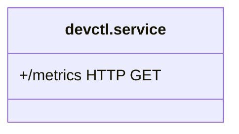

# Feature Delivery Playbook - Dev-Container Launcher v2

Below is a feature-delivery playbook that an LLM-powered assistant (or agent team) can follow to extend the Dev-Container Launcher v2 into a production-calibre platform.

---

## 0. Operating Assumptions

- Codebase lives in a Git repository already containing `devctl/`, `app.py`, and the Web UI.
- The LLM assistant has:
  - Read/write access to that repo (e.g., via the GitHub API).
  - Ephemeral sandboxes with Docker & Neo4j available for integration tests.
  - Permission to push feature branches and open PRs that a human will review.
- All new code follows the Python ≥ 3.12 and TypeScript ≥ 5 baselines.

---

## 1. Agent Roles & Toolchain

| Agent | Purpose | Key Tools / APIs |
|-------|---------|------------------|
| **Planner** | Breaks large epics into executable tasks, maintains the roadmap graph in Neo4j | OpenAI function-calling, Neo4j Bolt |
| **Researcher** | Looks up docs, best practices, CVEs | web.run search endpoints |
| **Coder** | Generates & refactors code, writes unit tests | GitHub API, docker-python SDK, pytest |
| **Tester** | Spins up containers, runs smoke & performance tests | Docker CLI, devctl, tox, Locust |
| **Reviewer** | Static analysis, security scan, style | ruff, bandit, OPA policy linter |
| **Doc-Gen** | Updates markdown docs & OpenAPI specs | pygments, mkdocs |
| **Integrator** | Merges once ✅ checks pass, deploys to staging | GitHub Actions, ArgoCD |

Each agent has read access to the task graph stored in Neo4j; only Planner and Integrator may write.

---

## 2. Delivery Workflow (per feature)

1. **Ideation**  
   Planner creates `(:Feature {id, title, rationale, target_release})` + child `(:Task)` nodes.

2. **Kick-off Comment** (GitHub issue)
   ```markdown
   ### {Feature Title}
   Auto-generated spec in /specs/{id}.md
   Tasks: - [ ] T-123 - [ ] T-124 ...
   ```

3. **Branch Automation**  
   Integrator opens `feature/{id}` branch. Coder checks it out.

4. **Implementation Loop**  
   Coder → Tester → Reviewer cycle until Reviewer sets `status/signed-off = true`.

5. **Graph Update**  
   On PR merge, Integrator sets `Task.status = "done"` and, if last task, `Feature.status = "done"`.

6. **Deploy & Observe**  
   GitHub Actions pushes to Docker Hub, ArgoCD promotes to staging → production. Metrics appear in Grafana.

---

## 3. Roadmap & Milestones

| Milestone (2-week sprints) | Features | Acceptance Criteria |
|---------------------------|----------|---------------------|
| **M1 – Container Power-Ups** | GPU image flavours, live Prometheus metrics | `docker run python-3.12-cuda` succeeds; Web/UI shows CPU & GPU %. |
| **M2 – Build Experience** | BuildKit remote cache, self-service image wizard | Builds are ≥ 40% faster after warm cache; wizard outputs validated Dockerfile & triggers build. |
| **M3 – Governance & Policy** | OPA policy engine, quota enforcement, idle-reaper | `deny` rules block >2 CPU containers for "free" users; idle containers auto-stop after N h. |
| **M4 – Productivity UX** | VS Code task templates, one-click TLS tunnels, CLIs for scripts | User can scaffold "pytest" task; TLS tunnel link appears in UI toolbar. |
| **M5 – Scalability** | Remote host pooling, agent-based image pre-fetch | Launching 100 containers < 90 s P95; images pre-pulled via DOMO agents. |

Planner encodes epics, tasks, dependencies in the Neo4j roadmap graph so agents can query `MATCH (:Task {assignee:$me, status:'open'})` each morning.

---

## 4. Detailed Feature Plans & Agent Check-lists

### 4.1 GPU-Ready Flavours (M1)

**Tasks**

| ID | Task | Agent | Done When |
|----|------|-------|-----------|
| T-101 | Draft `cuda.Dockerfile` & extend build script | Coder | `docker run python-3.12-cuda nvidia-smi` returns OK |
| T-102 | Detect GPU via `docker info --format '{{.Runtimes.nvidia}}'` | Tester | Unit test asserts GPU availability flag |
| T-103 | Add "GPU" badge & filter in Web/TUI | Coder | UI shows 🚀 icon; e2e Cypress test passes |
| T-104 | Update docs & examples | Doc-Gen | README.md#gpu section published |

**Risks & Mitigation**  
Driver mismatch → pin CUDA base to distro; run nightly smoke test.

---

### 4.2 Prometheus Metrics (M1)



| Check-list | Detail |
|------------|--------|
| **Exporter** | Add `prometheus_client` → `/metrics` endpoint. |
| **Data points** | Container CPU, Mem, Net, Volume I/O via Docker API. |
| **UI** | Grafana dashboard folder: Dev Containers. |
| **Tests** | Locust simulating 100 metrics scrapes/s. |

---

### 4.3 BuildKit Remote Cache (M2)

Enable BuildKit and push cache to registry:

```python
# devctl/builder.py
def build_image(tag, dockerfile, cache_repo="registry.example.com/cache"):
    return subprocess.run([
        "docker", "buildx", "build",
        "--builder", "devctl",
        "--cache-to", f"type=registry,ref={cache_repo}/{tag},mode=max",
        "--cache-from", f"type=registry,ref={cache_repo}/{tag}",
        "-f", dockerfile, "-t", tag, ".",
    ], check=True)
```

Tester spins first build (cold) and second build (warm) and asserts ≥ 40% time reduction.

---

### 4.4 Self-Service Image Wizard (M2)

1. **UI Form** – base tag dropdown, extra apt/yum packages list, expose ports.
2. **Wizard Agent** (Coder variant):
   - Generates a Dockerfile template.
   - Calls `devctl.build_image(...)`.
   - Returns image tag or error to UI.
3. **Policy Check** – OPA verifies allowed packages (no sudo, no docker).
4. **Graph** – `(:CustomImage {owner, tag, build_time})` node.

---

### 4.5 Policy Engine (M3)

Ship OPA as a sidecar to `devctl.service`.

**Sample Rule**
```rego
# Container quota policy
# Rego denies if user already has 2 running containers
deny[msg] {
  input.request.operation == "create"
  count(data.graph.user_containers[input.user]) >= 2
  msg := sprintf("User %s exceeds container quota", [input.user])
}
```

Tester runs `create()` thrice; expects HTTP 403 on third call.

---

### 4.6 Idle Reaper (M3)

| Step | Implementation |
|------|----------------|
| **Identify** | `docker stats` + last cursor attach timestamp (stored in Neo4j) |
| **Rule** | Stop if CPU < 2% for 4 h and no attachments |
| **Agent** | Cron job every 30 min in `devctl.service` |
| **Safety** | Label `keep-alive=true` bypasses reaper (settable in UI) |

---

## 5. Testing Matrix

| Layer | Tech | Tool |
|-------|------|------|
| **Unit** | Python | pytest-cov, ruff |
| **Integration** | Docker, Neo4j | tox envs, docker-compose |
| **UI** | React | Cypress |
| **Performance** | API | Locust |
| **Security** | Code | bandit, trivy image scan |
| **Policy** | OPA | conftest |

CI runs the full matrix on PR; Tester agent gatekeeps.

---

## 6. Metrics for Success

- 95% of container launches < 5 s (cold) / < 2 s (warm).
- Mean time-to-contribute (clone → coding in Cursor) < 3 min.
- < 1% of launches fail CI/CD checks.
- Zero CVSS > 7 vulnerabilities in base images.

Collect via Prometheus + Grafana; integrate with Slack alerts.

---

## 7. Risk & Mitigation

| Risk | Probability | Impact | Mitigation |
|------|-------------|--------|------------|
| GPU driver mismatch | Medium | High | Maintain matrix tests on GH Runners with NVIDIA runtime |
| OPA false positives | Medium | Medium | Dry-run mode for one sprint, log-only |
| Cache registry outage | Low | Medium | Fallback to local cache `~/.cache/buildkit` |
| LLM hallucination | Medium | High | Reviewer agent & human merged PR review |

---

## 8. Governance & Continuous Improvement

- Roadmap resides in Neo4j; Planner refreshes burndown every morning.
- Monthly retrospective: export metrics, auto-generate PDF via Doc-Gen agent, attach to GitHub Discussions.
- Feature flags managed by LaunchDarkly SDK; agents can roll out by cohorts.

---

## TL;DR

1. Agent team with Planner → Coder → Tester → Reviewer → Integrator pipeline.
2. Graph-backed roadmap in Neo4j powers autonomous, traceable task execution.
3. Six high-impact features queued across three milestones, each with explicit tests and success metrics.
4. LLM assistant iterates safely—guard-railed by OPA policies, CI checks, and human oversight—toward an enterprise-ready dev-container platform.
